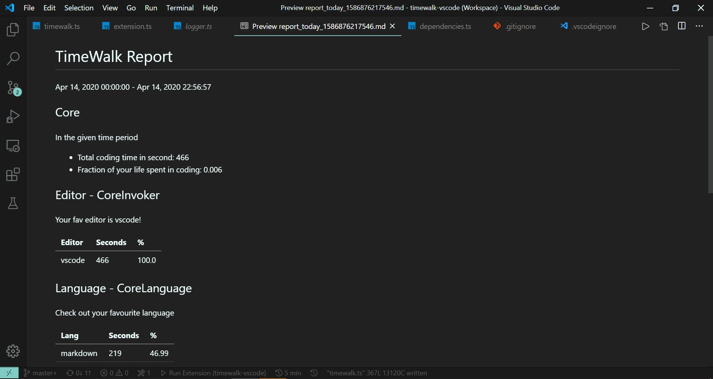

TimeWalk-VSCode
=================

TimeWalk-VSCode provides you with coding statistics tracking. You may easily get the metrics of your coding activity including

- Languages
- Projects
- Other categories by extending [TimeWalk-Core][timewalk-core]

TimeWalk is 100% free and extensible! Using TimeWalk,

- Users may not pay to get their stats
- Users may not sign up for a account and send their stats to a server
- Users may customize [TimeWalk][timewalk-core] to tailor it to your needs.

Installation
------------
- Search 'TimeWalk-VSCode' in your VSCode extension marketplace.
- Install and restart VSCode

Usage
------------
After installation, code for a while. Then you can

Press `F1` or `Ctrl + Shift + P` and type in the command `TimeWalk: Show Report`, choose the time range you want then `Enter`. 

Voila, here is your report.

-----------------------------------------------------------------------------------------------------

[timewalk-core]: https://github.com/desmondlzy/timewalk-core